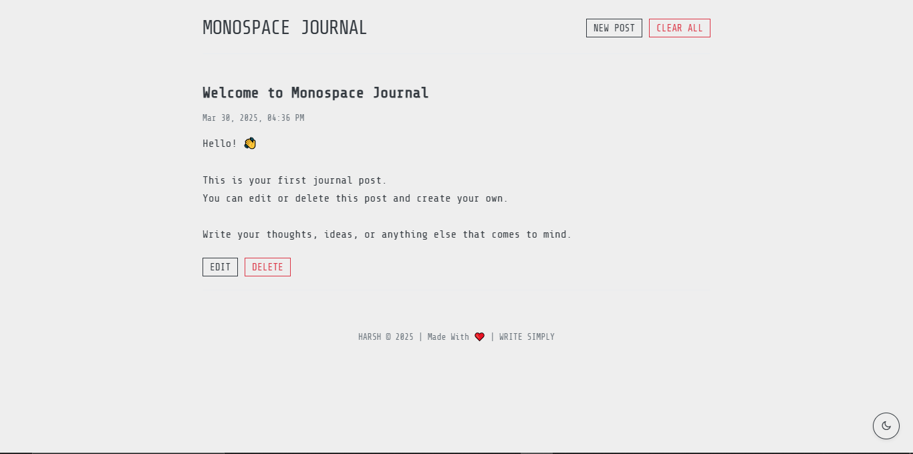

# Monospace Journal

A simple, clean, and minimalist web-based journal application.

## Description

Monospace Journal allows users to create, edit, and delete journal entries directly in their web browser. It features a monospace font aesthetic for a focused writing experience. Posts are saved locally in the browser's storage, ensuring privacy and persistence across sessions.

## Features

* **Create New Posts:** Easily add new journal entries with a title and content.
* **Edit Existing Posts:** Modify the title or content of previously saved posts.
* **Delete Posts:** Remove individual posts or clear all entries.
* **Local Storage:** All journal entries are saved automatically in the browser's local storage.
* **Dark/Light Mode:** Toggle between dark and light themes for comfortable viewing.
* **Keyboard Shortcuts:**
    * `Ctrl+Enter`: Submit a new post.
    * `Escape`: Close the new post form.
* **Responsive Design:** Adapts to different screen sizes.
* **Welcome Modal:** Provides helpful shortcuts on first visit or subsequent visits.
* **Confirmation Modals:** Asks for confirmation before deleting posts or clearing all entries.

## Files Included

* `index.html`: The main structure of the web page.
* `style.css`: Handles the visual styling and themes (including dark mode).
* `script.js`: Contains the JavaScript logic for post management, local storage interaction, theme toggling, and modals.

## How to Use

Simply open the `index.html` file in a web browser to start using the Monospace Journal.
